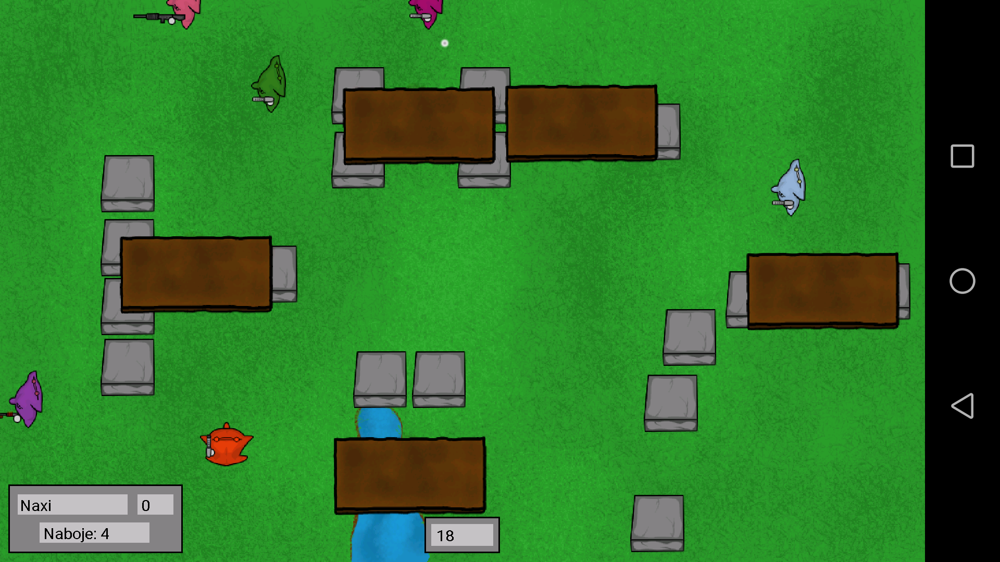
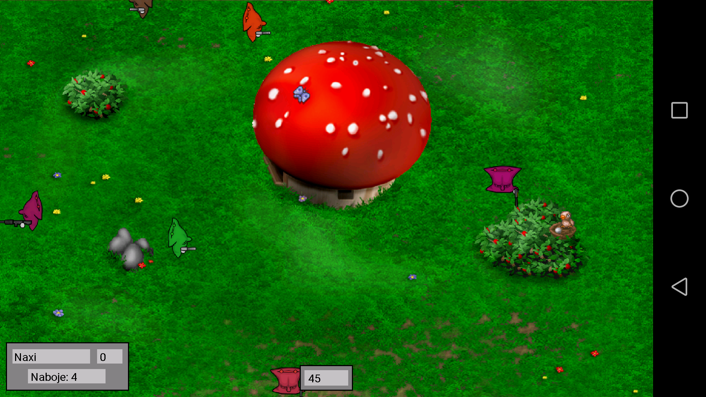
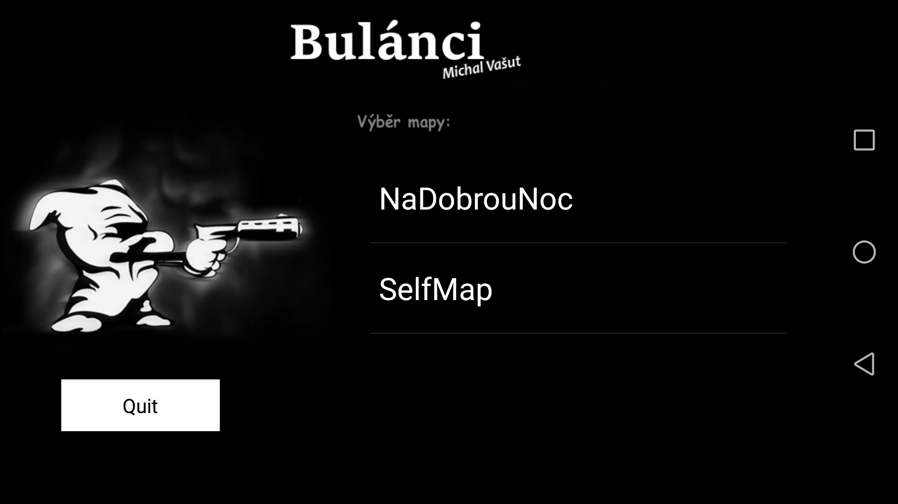

# Bulanci
Projekt do předmětu TAMZ II, vytvořil Michal Vašut VAS0166.

Jedná se o přenesení klasické hry bulánky na mobilní zařízení (Android). Pro toho kdo nezná hru bulánky, tak je to jednoduchá 2D hra, ve které proti sobě bojují bulánci/polštáře. 

Hra obsahuje:

- Výběr z 16 777 216 barev bulánků!!!
- Možnost nastavení hry
- Více map nebo vkládání vlastních
- Souboj proti více nepřátelům
- Více druhů zbraní
- Zvuky a jiné efekty
- Střelba pomocí proximity sensoru

Pokud si chcete zahrát, tak budete potřebovat i nějakou mapu.
Ve složce Mapy/ máte jednu moji ukázku mapy (Selfmap). 
Abyste ji dostali do hry, musíte ji vložit na SD kartu nebo paměť telefonu do složky "/bulanci" 

Mapy si lze jednoduše vytvářet sám pomocí xml tagů. Ve složce Mapy je ukázka mapy, kde je přehled všech možných tagů.
Mapa má velikost 1100x640. 
Skládá se z: 
ground - background of map, 
background - background objects, 
foreground - foreground objects. 
Všechny obrázky je potřeba loadnout do paměti pomocí load. 
Kolize se zase dělají pomocí collision a levého horního rohu + pravého dolního rohu obdélníku kolize.

